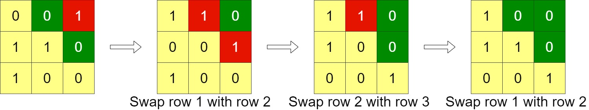

[Problem statement](https://leetcode.com/problems/minimum-swaps-to-arrange-a-binary-grid/)

Given an n x n binary grid, in one step you can choose two adjacent rows of the grid and swap them.

A grid is said to be valid if all the cells above the main diagonal are zeros.

Return the minimum number of steps needed to make the grid valid, or -1 if the grid cannot be valid.

The main diagonal of a grid is the diagonal that starts at cell (1, 1) and ends at cell (n, n).

 

**Example 1:**

Input: grid = `[[0,0,1],[1,1,0],[1,0,0]]`  Output: 3 

**Example 2:**

Input: grid = `[[0,1,1,0],[0,1,1,0],[0,1,1,0],[0,1,1,0]]`  Output:
-1  Explanation: All rows are similar, swaps have no effect on the
grid. 

**Example 3:**

Input: grid = `[[1,0,0],[1,1,0],[1,1,1]]`  Output: 0
 

**Constraints:**

`n == grid.length`  `n == grid[i].length`  `1 <= n <= 200` 
`grid[i][j] is 0 or 1` 